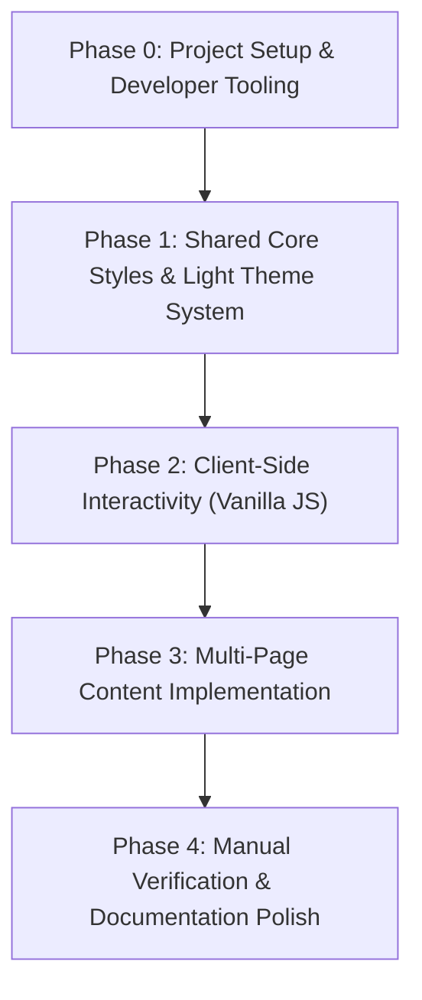

# Implementation Plan: Initial Site Layout

**Branch**: `001-initial-site-layout` | **Date**: 2026-08-22 | **Spec**: [spec.md](spec.md)

**Input**: Feature specification from `specs/001-initial-site-layout/spec.md`

## Summary

Build a modern, responsive, multi-page static profile/portfolio website for a software professional using pure HTML5, CSS3, and Vanilla JavaScript. The site includes a persistent header navigation, a consistent footer, a clean light theme, and dedicated pages (`index.html`, `experience.html`, `projects.html`, `skills.html`, `contact.html`) populated with realistic placeholder content. A minimal `package.json` provides zero-build local preview serving via `npm start`.

## Technical Context

**Language/Version**: HTML5, CSS3, Vanilla JavaScript (ES6+)

**Primary Dependencies**: None for production (zero-build static assets); `serve` in devDependencies for local preview server.

**Storage**: N/A (Pure static website)

**Testing**: None (Zero automated testing policy per Constitution Principle IV; manual visual browser verification only)

**Target Platform**: Modern web browsers (Desktop, Tablet, Mobile)

**Project Type**: Multi-page Static Web Application

**Performance Goals**: First contentful paint < 1s, smooth 60fps responsive navigation interactions

**Constraints**: Pure static stack, clean light theme, zero build steps, well-documented code

**Scale/Scope**: 5 static HTML pages, 1 shared CSS stylesheet, 1 shared JS script, 1 package.json

## Constitution Check

*GATE: Must pass before Phase 0 research. Re-check after Phase 1 design.*

| Principle | Status | Notes |
|---|---|---|
| **I. Clean, Readable, and Well-Documented Code** | **PASS** | Every file will contain header documentation; functions and CSS rules will be cleanly commented. |
| **II. Pure Static Foundation (HTML, CSS, JS)** | **PASS** | Pure HTML5, CSS3, and Vanilla JS without any front-end frameworks. |
| **III. Modern, Responsive Design & UX** | **PASS** | Clean light theme with responsive mobile navigation drawer, fluid typography, and flexbox/grid layouts. |
| **IV. Zero Automated Testing Policy** | **PASS** | Strict zero-test policy enforced; no test harnesses or runner dependencies created. |
| **V. Architectural Simplicity & Minimal Dependencies** | **PASS** | Flat static root structure with `css/` and `js/` directories; zero build step required. |

## Project Structure

### Documentation (this feature)

```text
specs/001-initial-site-layout/
├── plan.md              # This implementation plan
├── research.md          # Phase 0 technical decisions
├── data-model.md        # Phase 1 data entities and schemas
├── quickstart.md        # Phase 1 manual validation guide
├── contracts/
│   └── layout-contract.md # Phase 1 HTML/DOM component contracts
└── checklists/
    └── requirements.md  # Specification quality checklist
```

### Source Code (repository root)

```text
my-profile-site-with-spec/
├── index.html           # Home / About overview page
├── experience.html      # Career timeline & achievements page
├── projects.html        # Projects showcase & card grid page
├── skills.html          # Technical skills & categorized badges page
├── contact.html         # Direct contact channels & reach-out cards
├── css/
│   └── styles.css       # Shared design system, light theme tokens, responsive styles
├── js/
│   └── main.js          # Shared lightweight Vanilla JS (nav drawer, back-to-top)
├── package.json         # Minimal dev preview script (`npm start`)
└── .gitignore           # Git ignore rules
```

**Structure Decision**: A clean, flat static layout where HTML documents reside at the root for straightforward URL routing (`/index.html`, `/projects.html`), referencing modular assets under `css/` and `js/`.

## Planned Implementation Phases



### Phase 0: Project Setup & Developer Tooling
- Initialize `package.json` with metadata and `"scripts": { "start": "serve . -l 3000", "dev": "serve . -l 3000" }` and devDependency `serve`.
- Create directory folders `css/` and `js/`.

### Phase 1: Shared Core Styles & Design System Tokens (`css/styles.css`)
- Define CSS Custom Properties (`:root`) for the Clean Light Theme:
  - Backgrounds: `#f8fafc`, `#ffffff`, `#f1f5f9`.
  - Typography: System sans-serif / Inter stack, primary text `#0f172a`, secondary text `#64748b`.
  - Accent colors: `#2563eb` (primary blue), `#1d4ed8` (hover blue), `#e2e8f0` (border lines).
  - Shadows, border radii, spacing scale, transitions.
- Build shared layout components:
  - Header, brand logo, navigation links, active navigation indicator styling.
  - Mobile hamburger toggle button and slide-down / overlay navigation menu drawer.
  - Main container wrapper, section headers, subtitle typography.
  - Footer container, social links grid, and back-to-top floating/inline button.
  - Reusable card containers, tag badges, timeline connectors, and contact blocks.

### Phase 2: Client-Side Interactivity (`js/main.js`)
- Implement mobile navigation menu toggle (`#nav-toggle` click event, `aria-expanded` toggle, `.nav-open` state).
- Implement keyboard navigation & auto-close behavior (close drawer on link click or Escape key).
- Implement smooth "Back to Top" scrolling (`#back-to-top` click handler).
- Add full JSDoc comments and flow explanations across `main.js`.

### Phase 3: Multi-Page Content Implementation
- **Step 3.1: Home & About (`index.html`)**
  - Implement hero banner, introduction tagline, professional bio placeholder, quick highlights, and call-to-action buttons.
- **Step 3.2: Career Experience (`experience.html`)**
  - Implement chronological career timeline with role titles, company names, date periods, achievement bullets, and skill tags.
- **Step 3.3: Projects Showcase (`projects.html`)**
  - Implement responsive project cards grid with titles, summaries, feature lists, tech stack badges, and demo/repo action buttons.
- **Step 3.4: Technical Skills (`skills.html`)**
  - Implement categorized skill cards (Languages, Frameworks, Cloud & DevOps, Databases & Tools) with visual badges and proficiency tags.
- **Step 3.5: Direct Contact Channels (`contact.html`)**
  - Implement direct contact cards (Email, LinkedIn, GitHub, Location/Timezone, Resume Download) with icons and action links.

### Phase 4: Manual Verification & Documentation Polish
- Launch local static server via `npm start` (or native server).
- Perform comprehensive manual browser verification across Desktop, Tablet (768px), and Mobile (375px) viewports following [quickstart.md](quickstart.md).
- Validate zero broken links, zero console errors, zero layout shifts, and verify all file documentation headers comply with Constitution Principle I.

## Complexity Tracking

> **Constitution Check has 0 violations. No special justifications required.**
