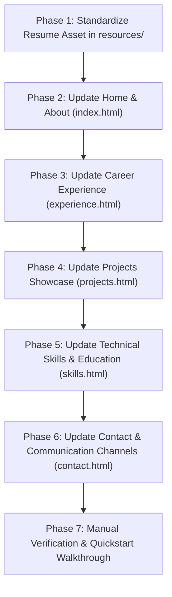

# Implementation Plan: Update From Resume

**Branch**: `002-update-from-resume` | **Date**: 2026-08-22 | **Spec**: [spec.md](spec.md)

**Input**: Feature specification from `specs/002-update-from-resume/spec.md`

## Summary

Update the profile website across all 5 static pages (`index.html`, `experience.html`, `projects.html`, `skills.html`, `contact.html`) with authentic professional data extracted directly from the candidate's uploaded resume (`resources/RaghuAIEng.pdf`). Standardize the public download link to `resources/resume.pdf`, ensuring visitors can view and download the resume with one click from multiple high-visibility locations on the site.

## Technical Context

**Language/Version**: HTML5, CSS3, Vanilla JavaScript (ES6+)

**Primary Dependencies**: None (pure static web application; zero build step required).

**Storage**: Static assets in `resources/` (PDF files: `RaghuAIEng.pdf` and `resume.pdf`).

**Testing**: None (Zero automated testing policy per Constitution Principle IV; manual visual browser verification only).

**Target Platform**: Modern web browsers (Desktop, Tablet, Mobile).

**Project Type**: Multi-page Static Web Application.

**Constraints**: Pure static stack, clean light theme, zero build steps, well-documented code per Constitution Principles I–V.

## Constitution Check

*GATE: Must pass before Phase 0 research. Re-check after Phase 1 design.*

| Principle | Status | Notes |
|---|---|---|
| **I. Clean, Readable, and Well-Documented Code** | **PASS** | Every updated HTML file maintains descriptive header documentation and semantic comments. |
| **II. Pure Static Foundation (HTML, CSS, JS)** | **PASS** | Pure HTML5, CSS3, Vanilla JS; no frameworks or backend runtimes. |
| **III. Modern, Responsive Design & UX** | **PASS** | Clean light theme, responsive grid/timeline cards, fluid badges, accessible PDF download buttons. |
| **IV. Zero Automated Testing Policy** | **PASS** | Strict zero-test policy enforced; verified through manual browser inspection per [quickstart.md](quickstart.md). |
| **V. Architectural Simplicity & Minimal Dependencies** | **PASS** | Flat root static layout with `resources/`, `css/`, and `js/`. |

## Project Structure

### Documentation (this feature)

```text
specs/002-update-from-resume/
├── plan.md              # This implementation plan
├── research.md          # Phase 0 technical decisions
├── data-model.md        # Phase 1 data entities and resume mapping
├── quickstart.md        # Phase 1 manual validation guide
├── contracts/
│   └── layout-contract.md # Phase 1 DOM & download link contracts
└── checklists/
    └── requirements.md  # Specification quality checklist
```

### Source Code (repository root)

```text
my-profile-site-with-spec/
├── index.html           # Home / About: Updated with Lead Staff AI Engineer headline, bio, pillars & resume CTA
├── experience.html      # Experience: Updated with Salesforce, BlackRock, Yahoo!, Prompt Technologies history
├── projects.html        # Projects: Updated with Agentforce, RAG pipelines, LLM Cost-Router & ADK showcases
├── skills.html          # Skills: Updated with GenAI, Vector DBs, LLM frameworks, languages, education & certs
├── contact.html         # Contact: Updated with raghu.bayaneni@gmail.com, (209) 597 8323, LinkedIn, resume card
├── css/
│   └── styles.css       # Shared styles & light theme design tokens
├── js/
│   └── main.js          # Client-side mobile drawer & back-to-top interactivity
├── resources/
│   ├── RaghuAIEng.pdf   # Source uploaded resume
│   └── resume.pdf       # Standardized public download link
└── package.json         # Dev preview server (`npm start`)
```

## Planned Implementation Phases



### Phase 1: Standardize Resume Asset
- Synchronize/copy `resources/RaghuAIEng.pdf` to `resources/resume.pdf` to establish the standardized public URL.

### Phase 2: Update Home & About (`index.html`)
- Update document title and meta description.
- Set headline to "Lead Staff Engineer | Full-Stack, AI & Forward Deployed Systems".
- Replace bio with 15+ years experience in high-scale architectures, production RAG pipelines, and autonomous AI Agents.
- Update 3 Core Pillars: Generative AI & Agentic Orchestration, System Architecture & Engineering, Engineering Strategy & Forward Deployment.
- Add prominent "View / Download Resume" primary CTA button pointing to `resources/resume.pdf`.

### Phase 3: Update Career Experience (`experience.html`)
- Salesforce (Lead Technical Staff Engineer - AI Systems & Web Platforms, 2012 — Present/Recent): LLM Orchestration, Autonomous Agentic AI Runtimes, Production RAG, Model Optimization & PEFT, Full-Stack AI.
- BlackRock (Senior Software Engineer - Full Stack Web, 2011 — 2012): Large-scale financial platforms, system modernization, SPAs.
- Yahoo! (Software Engineer - Full Stack Web, 2008 — 2011): High-traffic web properties, APT ad-tech platform, front-end at scale.
- Prompt Technologies (Software Engineer - Full Stack Web, 2006 — 2008): Java MVC scheduling systems, Adobe Flex RIA, DMS integrations.

### Phase 4: Update Projects Showcase (`projects.html`)
- Featured Project 1: Agentforce & Einstein AI Agent Orchestration Gateway.
- Featured Project 2: Enterprise Production-Grade RAG & Data Cloud Streaming Pipeline.
- Featured Project 3: LLM Cost-Router & Small Language Model (SLM) Dispatcher.
- Featured Project 4: SpecKit Studio & Autonomous Agent Development Kit (ADK).
- Featured Project 5: Yahoo APT Global Advertising Network.
- Featured Project 6: Mission-Critical Financial Portfolio Management Portal.

### Phase 5: Update Technical Skills (`skills.html`)
- Category 1: Generative AI & LLM Orchestration (Models, Frameworks, Techniques, Salesforce AI).
- Category 2: Vector Databases, AI Data Infrastructure & Observability (Vector Stores, Data Ops, Evaluation tools).
- Category 3: Web & Full-Stack Architecture (Languages, Frontend, Backend & APIs).
- Category 4: Databases, Cloud & Infrastructure (Databases, Cloud & DevOps).
- Add Education & Certifications section: Stanford ML Specialization, Salesforce AI Agentblazer Champion, Master's & Bachelor's Degrees.

### Phase 6: Update Contact & Footer (`contact.html`)
- Update email to `raghu.bayaneni@gmail.com`.
- Update phone to `(209) 597 8323`.
- Update LinkedIn link to `https://www.linkedin.com/in/raghuramz`.
- Update location to "San Francisco - Bay Area, California".
- Add direct Resume Download card linking to `resources/resume.pdf`.
- Update site footers across all HTML pages with matching LinkedIn and Resume PDF links.

### Phase 7: Manual Verification
- Test all links, resume PDF downloads, and responsive layouts per `quickstart.md`.

## Complexity Tracking

> **Constitution Check has 0 violations. No special justifications required.**
